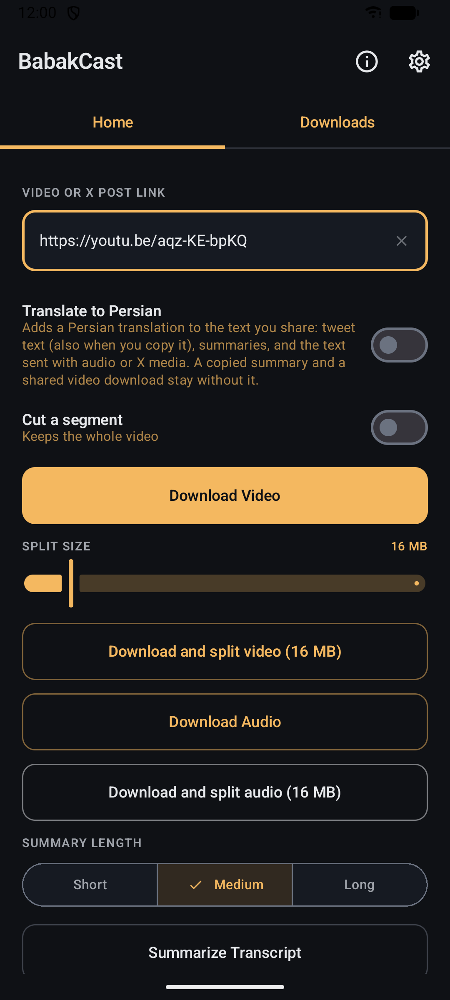
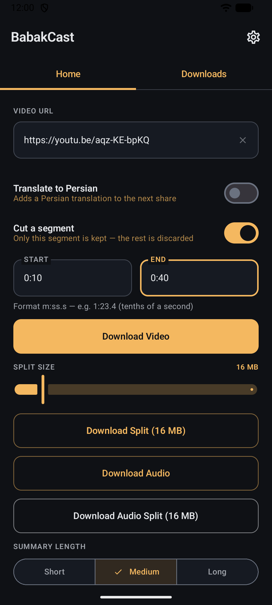

# BabakCast

An Android app that downloads videos from YouTube, X (Twitter), Instagram and LinkedIn, copies and shares tweet text, and summarizes YouTube transcripts (the written text of what is said) with your own AI provider. Your downloads stay on your phone. Only the text you send for a summary or translation goes to the AI provider you choose.


## Installation

<!-- cocode-apps:install:start -->
- Coming to F-Droid
- [Download the Android installation file (APK) from GitHub](https://github.com/cocodedk/BabakCast/releases/latest/download/BabakCast.apk)
- [Add the app to Obtainium, an app that keeps it up to date](https://apps.obtainium.imranr.dev/redirect?r=obtainium://add/https://github.com/cocodedk/BabakCast)
<!-- cocode-apps:install:end -->

### Requirements

- Android 7.0 (API 24) or higher.
- For summaries and translations: an API key from an AI provider. In this version, OpenAI and OpenRouter work. Azure OpenAI, Anthropic and Google Gemini are listed in Settings but are not finished yet.

---

## Website
- [English](https://cast.cocode.dk/)
- [Dansk (Danish)](https://cast.cocode.dk/da/)
- [فارسی (Persian)](https://cast.cocode.dk/fa/)

---

## Features

- **YouTube video download**: paste a link and get a video file to share. Tap *Download Video* for one file, or *Download and split video* to divide a larger video into parts of the size you choose (16 MB by default, a common messaging limit).
- **X (Twitter) video download**: paste an X.com or Twitter.com post link to download videos from public posts.
- **X (Twitter) post media download**: tap *Download Post Media* to save a post's photos, videos and GIFs and share them together. A post can have up to 4 photos, and animated GIFs work too. A post that has both photos and videos saves the photos only.
- **X (Twitter) tweet text copy and share**: paste an X or Twitter link, then tap *Copy Text* to copy the tweet text to the clipboard, or *Share Text* to open the Android share sheet. No media download is needed.
- **Instagram video download**: paste an Instagram post, reel or IGTV link to download videos.
- **LinkedIn video download**: paste a LinkedIn post or feed update link to download videos from public posts.
- **Audio download**: extract the audio (MP3) from YouTube, X or Instagram videos. *Download Audio* gives you one file. *Download and split audio* splits it at the size you choose (16 MB by default) and tags each part "Part n of N", so recipients can tell the order even when a messaging app shows the parts in a different one.
- **Optional segment cut**: turn on *Cut a segment*, type a start and end time (`m:ss.s`, accurate to a tenth of a second) and only that segment is saved. The rest of the download is discarded. This works on every source, and on audio downloads too. With the toggle off, the whole video is kept.
- **Transcript summary**: for a YouTube video, BabakCast gets the captions and asks your AI model for a bullet-point summary. Choose Short, Medium or Long on the Home screen.
- **Bring your own AI**: add your own API key and model under **Settings > AI Providers**. OpenAI and OpenRouter work in this version. Azure OpenAI, Anthropic and Google Gemini are listed but not finished yet.
- **No developer backend**: downloading, splitting and cutting run on your phone. Summaries and translations send text to the AI provider you set up. There are no accounts, no analytics and no tracking.
- **Encrypted API keys**: stored on your phone with Android's EncryptedSharedPreferences.
- **Optional Persian translation**: turn on *Translate to Persian* on the Home screen and BabakCast adds an AI-generated Persian translation below the original in the text you copy or share: tweet text, summaries, and the text that goes with audio and X media. A copied summary, shared video downloads and shares from the Downloads tab are not translated. Slow providers get up to 3 minutes. While it runs, *Use original text* skips the translation and shares the original, but if the provider has not answered yet, sharing can wait until that request ends.

---

## Philosophy

> **BabakCast is a personal-use tool.**
> It does not ship with API keys, ads, analytics, or accounts.
> You control your data and your AI provider.

---

## Screenshots

| Main screen | Cutting a segment |
|-------------|-------------------|
| [](fastlane/metadata/android/en-US/images/phoneScreenshots/1.png) | [](fastlane/metadata/android/en-US/images/phoneScreenshots/2.png) |

---

## Usage

1. **Download a video**: paste a YouTube, X (Twitter), Instagram or LinkedIn link and tap *Download Video*. BabakCast saves one video file and opens the share sheet. To divide a larger video into parts, tap *Download and split video* instead.
2. **Download a post's media (X/Twitter)**: paste an X or Twitter link and tap *Download Post Media*. BabakCast saves the post's photos, videos and GIFs and opens the share sheet with them. A post with both photos and videos saves the photos only.
3. **Copy or share tweet text**: paste an X or Twitter link, then tap *Copy Text* to copy the tweet text to your clipboard (a message confirms it), or *Share Text* to open the Android share sheet.
4. **Download audio**: paste a YouTube, X or Instagram link. Tap *Download Audio* for a single MP3, or *Download and split audio* to split it at your chosen size (16 MB by default). Each part is tagged "Part n of N" and the share caption notes the count, so recipients can tell the order. Sharing is in two steps: BabakCast first shares the title, then you come back to BabakCast to share the MP3 file or the numbered parts.
5. **Summarize a transcript**: first open **Settings**, tap a provider under **AI Providers**, enter its API key, select a model and tap *Save and use this provider*. Then paste a YouTube link and tap *Summarize Transcript*. Your API key is sent only to the provider you choose. Summaries work for YouTube videos only.
6. **Cut a segment**: turn on *Cut a segment* and enter the start and end times as `m:ss.s` (for example `1:23.4` to `1:25.6`). The download is cut to exactly that range before it is split or shared, and nothing outside it is kept.

---

## AI providers

| Provider | Config in app | Status in this version |
|----------|---------------|------------------------|
| OpenAI | API key + model (e.g. gpt-4o-mini) | Works |
| OpenRouter | API key + model (e.g. openai/gpt-4o) | Works |
| Azure OpenAI | API key + endpoint URL + model | Listed in Settings, not finished: the endpoint is not saved |
| Anthropic | API key + model | Listed in Settings, not finished |
| Google Gemini | API key + model | Listed in Settings, not finished |

You can pick from suggested models or type a model name of your own.

---

## Tech stack

- **Kotlin** + **Jetpack Compose**
- **Hilt** for dependency injection
- **youtubedl-android** for media downloads from YouTube, X/Twitter, Instagram and LinkedIn, and for transcripts from YouTube
- **FFmpegKit** for video splitting
- **EncryptedSharedPreferences** for API key storage

---

## Privacy

BabakCast has no backend of its own: the developer runs no server and receives no data about you, and
the app has no accounts, no analytics, no ads and no tracking. It is not an offline app, though. When you
ask it to download media or summarize a transcript, it sends the links and content you provide directly
to the services involved: the source platform for a download, and only the AI provider you configure for a
summary. API keys are stored encrypted on the device and are not sent anywhere except to the provider you
choose. If Android backup is on, it may also copy them (still encrypted) with the rest of the app's data,
including downloads and transcripts, into your own Google backup.

Read the full policy at <https://cast.cocode.dk/privacy/> (also in [privacy.md](privacy.md)).

---

## Build

Needs Java 17 and the Android SDK (Android Studio).

### From source

1. Clone the repo:
   ```bash
   git clone https://github.com/cocodedk/BabakCast.git
   cd BabakCast
   ```
2. Open in Android Studio and run on a device or emulator (API 24+).

### Release build (CI)

On a **push or merge to `main`**, GitHub Actions builds the signed release APKs and publishes them as a GitHub release when `VERSION_NAME` in `gradle.properties` names a version that is not released yet. If that version is already released, the workflow skips the build and finishes green.

To enable signing, add these **repository secrets** (Settings → Secrets and variables → Actions):

| Secret | Description |
|--------|-------------|
| `KEYSTORE_BASE64` | Your release keystore file, base64-encoded (e.g. `base64 -w 0 release.keystore`) |
| `KEYSTORE_PASSWORD` | Keystore password |
| `KEY_ALIAS` | Key alias |
| `KEY_PASSWORD` | Key password |

Create a keystore locally (once) with:

```bash
keytool -genkey -v -keystore release.keystore -alias my-key -keyalg RSA -keysize 2048 -validity 10000
```

Then encode it for `KEYSTORE_BASE64`: e.g. `base64 -w 0 release.keystore` (Linux) or `base64 -i release.keystore` (macOS). Do **not** commit the keystore file.

If a signing secret is missing, the workflow stops at the *Verify signing secrets* step, before it builds anything. Set all four to get signed APKs from the [Actions](https://github.com/cocodedk/BabakCast/actions) run.

`./scripts/setup-signing.sh` does all of the above in one pass: it reuses an existing
`release.keystore` (or generates one), verifies the password, uploads the four secrets, and
stores the same values locally so your own builds are signed too.

#### Signing local builds

Debug builds are signed with the release keystore when the four values are available, so a
locally built APK can replace an installed release build with `adb install -r` — no uninstall,
no data loss. They are read in this order:

1. Environment variables — used by CI.
2. Gradle properties, normally `~/.gradle/gradle.properties`.
3. `local.properties` — still supported, but **Android Studio regenerates this file and will
   erase anything added to it**, silently leaving later builds unsigned. Prefer option 2.

`setup-signing.sh` writes to `~/.gradle/gradle.properties` (mode 600) for that reason, and
clears any stale copies out of `local.properties`. A relative `KEYSTORE_PATH` is resolved
against the project root.

---

## Contributing

[CONTRIBUTING.md](CONTRIBUTING.md) covers the local setup, the coding style and the pull request checklist. To report a security problem, follow [SECURITY.md](SECURITY.md).

### Development

A pre-commit hook runs unit tests before each commit. Enable it once:

```bash
git config core.hooksPath .githooks
```

Or run `./scripts/install-hooks.sh`. Commits will be blocked if `./gradlew test` fails.

---

## Author

**Babak Bandpey** — [cocode.dk](https://cocode.dk) | [LinkedIn](https://linkedin.com/in/babakbandpey) | [GitHub](https://github.com/cocodedk)

## License

Apache-2.0 | © 2026 [Cocode](https://cocode.dk) | Created by [Babak Bandpey](https://linkedin.com/in/babakbandpey)
